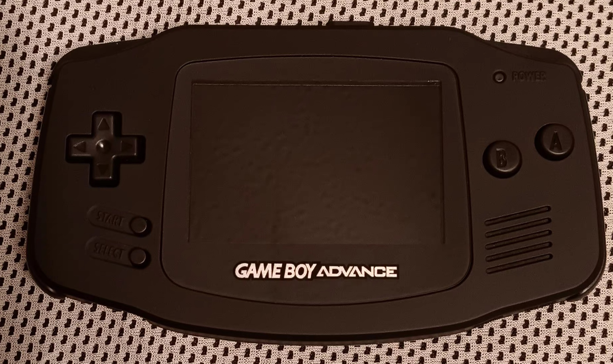

# 🕹️ All-Black IPS Modded GameBoy Advance – Build Guide

 <!-- Make sure to upload your image with this name or update the path -->

Revive your childhood handheld and give it a modern twist.  
This guide walks you through how I built an all-black, IPS screen-modded GBA with a 32-pin motherboard—my first-ever mod project!

---

## 📚 Table of Contents

- [Introduction](#introduction)
- [Parts & Tools I Used](#parts--tools-i-used)
- [Screw Types & Notes](#screw-types--notes)
- [Real-World Build Insight](#real-world-build-insight-what-i-learned)
- [Pre-Build Cleaning](#pre-build-cleaning-a-must-do)
- [Assembly Steps](#assembly-steps)
- [Optional Modern Upgrade](#optional-modern-upgrade)
- [Budget & Ordering](#my-budget--ordering-experience)
- [Conclusion](#conclusion)
- [FAQ](#faq-common-questions--troubleshooting)
- [Future Upgrades](#future-upgrades-take-it-further)

---

## 📖 Full Guide

Read the full Markdown guide with every step, note, and optional upgrade:
👉 [GBA_IPS_Mod_Guide.md](./GBA_IPS_Mod_Guide.md)

---

## ✨ Why I Built This

I completed this mod in about **3 hours**, using only beginner-friendly tools and a solderless IPS V2 screen kit.  
My goal was to restore a 20+ year-old handheld into something sleek, playable, and future-proof—with no more worm light!

This project taught me:
- How to plan and research a mod
- How to troubleshoot issues like stripped screws
- The importance of good documentation

Whether you’re a beginner or just GBA-curious—this guide is for you.

---

## 📸 Want to see the final build?

(./Blackout_GBA_turned-on.jpg)
---

Feel free to fork, improve, or ask questions via Issues or Pull Requests.
